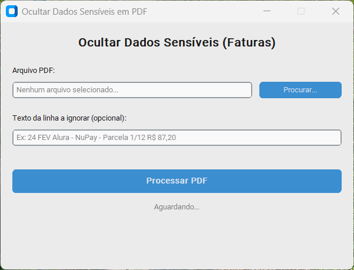
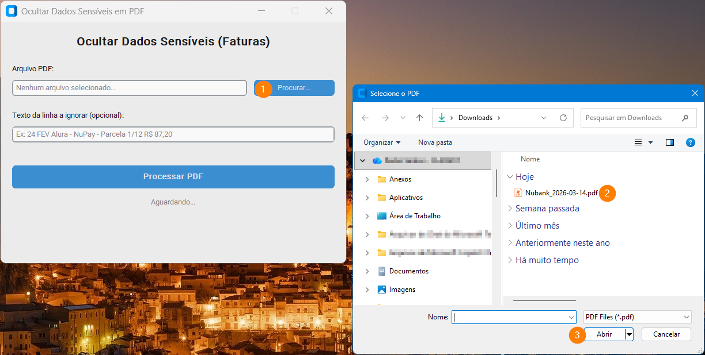
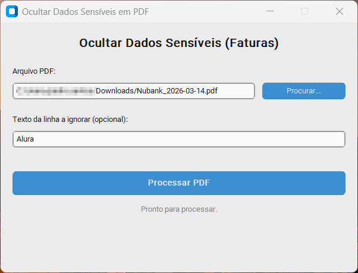
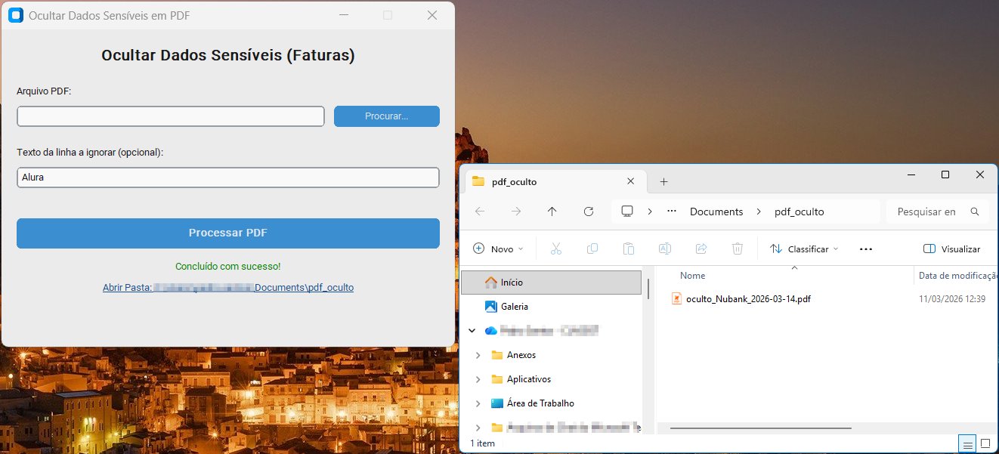
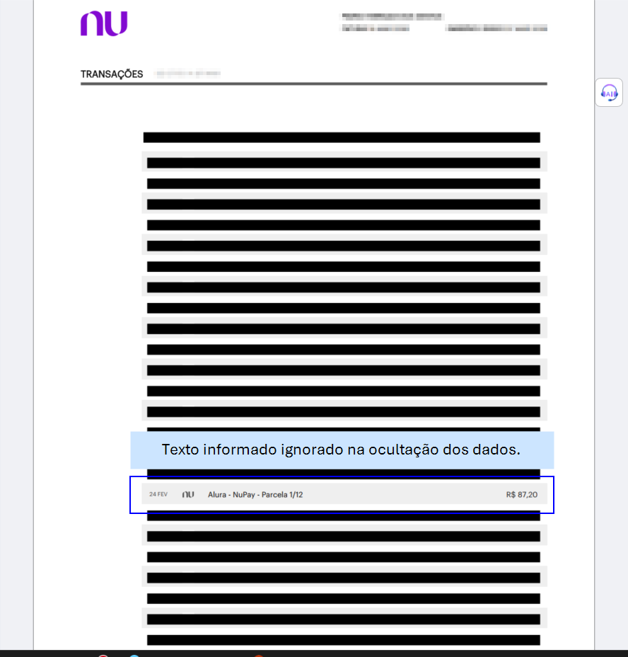

# Ocultar Dados Sensíveis de Faturas PDF

Este é um projeto em Python com interface gráfica desenvolvido para ler uma fatura em PDF, localizar e aplicar uma "tarja preta" sobre valores monetários sensíveis (ex: `R$ 87,20`, `1.450,00`) e dados pessoais como CPFs (ex: `123.456.789-00`).

## Como Funciona

O aplicativo usa a biblioteca `PyMuPDF` (`fitz`) para ler os componentes nativos dos arquivos PDF. Usando expressões regulares, ele acha dados críticos no texto, traça coordenadas de toda a linha contendo o dado, e substitui a visualização por um retângulo coberto. Além disso, o app permite informar um trecho (parte do texto) de uma linha específica para que seja totalmente ignorada do processo de censura.

## Telas do Aplicativo

1. **Tela Inicial do App**
   <br>
   
   <br>

2. **Fatura Original (Exemplo)**
   <br>
   
   <br>

3. **Iniciando o Processo**
   <br>
   
   <br>

4. **Fatura Ocultada**
   <br>
   
   <br>

5. **Acesso Fácil ao Resultado**
   <br>
   
   <br>

## Dependências

Você precisará de Python 3.x instalado em sua máquina. Para instalar os pacotes vitais para o app:

```bash
pip install -r requirements.txt
```

_(Ele utiliza `pymupdf` pro núcleo principal e `customtkinter` para a interface gráfica.)_

## Como Executar

Basta rodar o arquivo principal para iniciar a interface:

```bash
python app.py
```

## Como Gerar o Executável (.exe) Opcional

Caso queira gerar um aplicativo de janela nativo do Windows:

1. Instale o PyInstaller (`pip install pyinstaller`)
2. Execute o comando: `pyinstaller --noconfirm --onedir --windowed --hidden-import "customtkinter" --name "OcultarDadosPDF"  "app.py"`
3. O app compilado ficará na pasta `dist/OcultarDadosPDF`.
